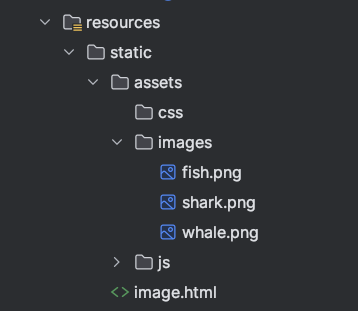
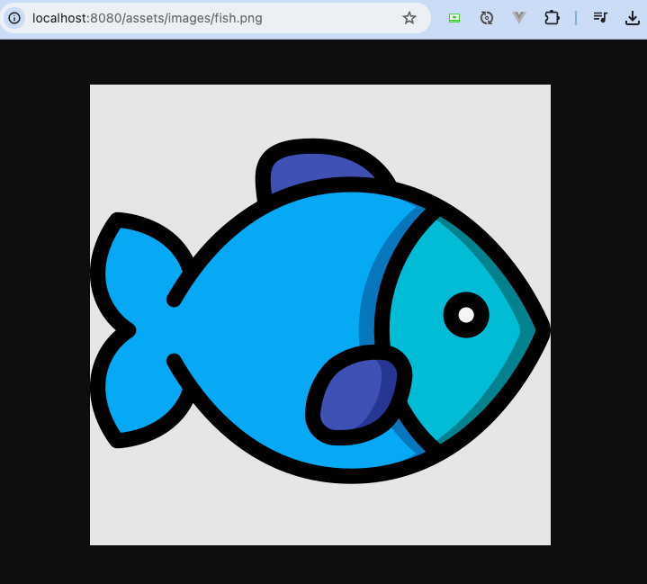
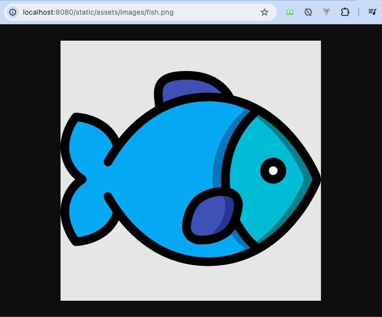
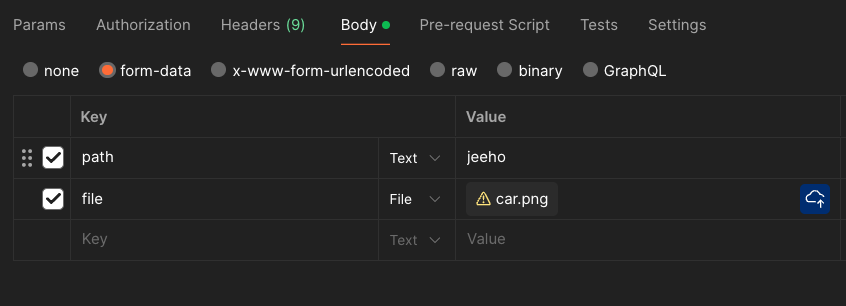

# 파일 다루기

## 정적 파일 다루기

정적 파일은 이미지, CSS, JS, 그리고 다른 어떤 종류의 파일이든 사용자에게 특별한 변화 또는 조작 없이
전달되는 파일들을 의미한다. Spring Boot의 기본 설정으로는, `resources/static` 폴더의 파일은
정적 파일로 전송될 수 있다.





정적 파일을 요청할 경로를 변경하고 싶다면 `spring.mvc.static-path-pattern` 설정을 변경한다.

```yaml
spring:
  mvc:
    # 어떤 경로에 대한 요청의 응답으로
    # 정적 파일 응답을 할지를 결정하는 설정
    static-path-pattern: /static/**
```



## multipart/form-data

파일을 보내는 입장에서는 `Content-Type` 헤더에 `multipart/form-data`를
추가해 요청한다. 이는 HTML의 `<form>`에서는 `enctype`으로 설정한다.

```html
<form enctype="multipart/form-data">
  <input type="text" name="name">
  <input type="file" name="photo">
  <input type="submit">
</form>
```

파일을 추가하는 `<input>`은 `type="file"`이다. `type="image"`는
이미지를 제출 버튼 (`type="submit"`) 대신 사용하는 용도이므로 햇갈리지 말자.

Postman에서는 Body에서 `form-data` 선택.



요청을 받을 때는 `@RequestParam`을 사용한다. 이때 받는 자료형은
`MultipartFile`이다. 파일을 다루면서 `IOException`의 발생 가능성이 있으므로
`throws`를 추가한다.

```java
@PostMapping(
        value = "/multipart", 
        consumes = MediaType.MULTIPART_FORM_DATA_VALUE
)
public ResponseDto multipart(
        @RequestParam("name") String name,
        @RequestParam("photo") MultipartFile multipartFile
) throws IOException { 
    // ...
}
```

`MultipartFile` 자료형에는 `transferTo()` 메서드가 있어서 `java.io.File` 또는 `java.nio.file.Path`
객체가 나타내는 파일에 저장할 수 있다. (이때 `IOException`이 발생할 수 있다.)

```java
// 저장할 경로를 생성한다
Files.createDirectories(Path.of("media"));
// 저장할 파일이름을 경로를 포함해 지정한다.
Path path = Path.of("media/filename.png");
// 저장한다.
multipartFile.transferTo(path);
```

만약 날것의 `byte[]` 데이터를 확인하고 싶다면 `getBytes()` 메서드를 활용할 수 있다.

```java
// 저장할 파일 이름
File file = new File("./media/filename.png");
// 파일에 저장하기 위한 OutputStream
try (OutputStream outputStream = new FileOutputStream(file)){
    // byte[] 데이터를 받는다.
    byte[] fileBytes = multipartFile.getBytes();
    // 여기에서 추가작업
    
    // OutputStream에 MultipartFile의 byte[]를 저장한다.
    outputStream.write(fileBytes);
}
```
